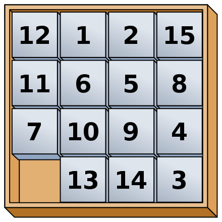

# PuzzleGame

PuzzleGame is a classic sliding puzzle game implemented using HTML, CSS, and JavaScript. Test your puzzle-solving skills by rearranging the numbered tiles to form the correct sequence. This game offers an entertaining and brain-teasing experience.

## Play the Game

You can play the game online by visiting the following link:
[Play PuzzleGame](https://ptprashanttripathi.github.io/PuzzleGame/)

## How to Play

1. Choose the puzzle grid size from the dropdown menu.
2. Click the "Submit" button to start the game with the selected grid size.
3. Rearrange the tiles by clicking on a tile adjacent to the empty space.
4. Continue rearranging tiles until you successfully solve the puzzle.

## Features

- Clean and modern Material Design user interface.
- Responsive layout that adapts to different screen sizes.
- Interactive puzzle grid that challenges your logic and concentration.
- Keeps track of the total moves you've made.
- Provides feedback when you successfully solve the puzzle.

## Contributing

Contributions to PuzzleGame are welcome! Feel free to open issues for bug reports, feature requests, or improvements. If you'd like to contribute directly, please follow these steps:

1. Fork the repository.
2. Create a new branch for your feature or bug fix.
3. Make your changes and commit them.
4. Push your changes to your fork.
5. Submit a pull request to the main repository.

## License

This project is licensed under the [MIT License](LICENSE).

---

Created by [PtPrashantTripathi](https://github.com/PtPrashantTripathi)
